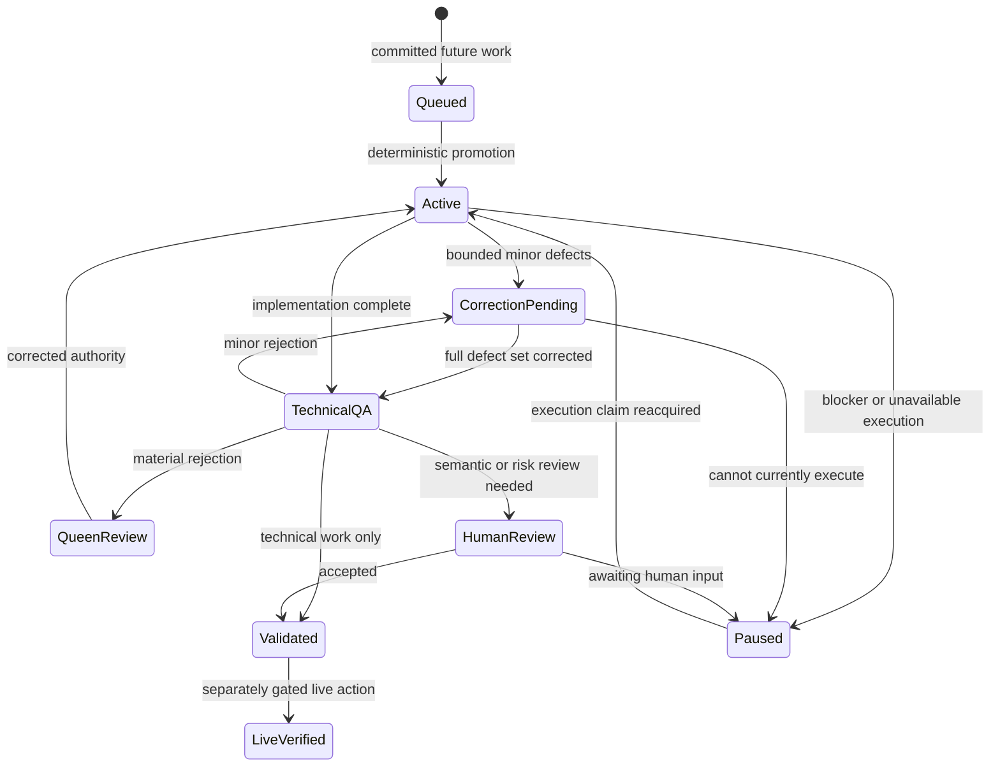
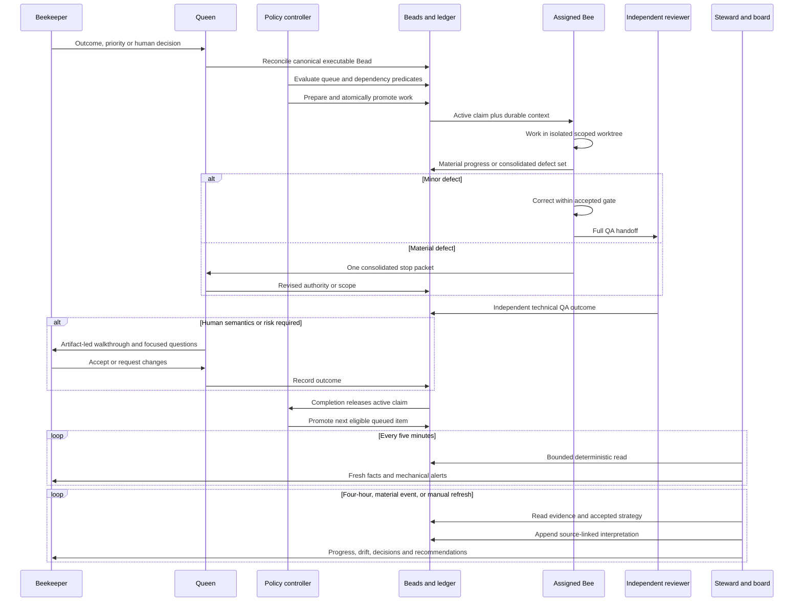

# Hive and Steward System Architecture

- Status: architecture review draft
- Last updated: 2026-08-20
- Authoritative planning inputs: `isovalent-r3f7.1`,
  `isovalent-r3f7.2.1-.7`, `isovalent-r3f7.3`,
  `isovalent-z3ts.2-.4`, and `isovalent-6bu.1.30.4`

## Purpose

This document describes the complete intended Hive and Steward system: the
beekeeper interface, Beehive launcher, Queen and Bee sessions, durable Beads
coordination, bounded reader, ledger, messages, reviews, work queue, guarded
autonomy, Steward reasoning, dashboard, Git delivery flow, reporting, backup,
recovery, and independent QA.

It is an architecture review artifact, not implementation authority. Canonical
executable scope remains in Beads.

## Design outcomes

The system must:

- make the current outcome, active work, responsibility, blockers, queue,
  reviews, decisions, and progress understandable to the beekeeper;
- recover coordination after agent restart or context loss without depending
  on chat transcripts or local session history;
- keep Beads as the sole durable project authority;
- distinguish a responsible owner from the active execution claim;
- support deterministic pre-authorized automation without granting an LLM
  arbitrary mutation capability;
- collect complete bounded defect sets while stopping immediately for unsafe
  live, destructive, credential, or rollback failures;
- preserve independent technical review while allowing minor corrections on
  the same bead and gate;
- separate five-minute deterministic facts from four-hour, material-event, or
  manually requested model interpretation;
- fail closed under ambiguity, resource exhaustion, concurrency, stale
  contracts, or partial transactions;
- keep human approval focused on semantics, risk, priority, and live effects,
  rather than raw code or security details.

## Complete system context

```mermaid
flowchart TB
    User["Beekeeper"]

    subgraph Terminal["Visible Beehive terminal"]
        Launcher["Beehive launcher<br/>validated configuration and role startup"]
        QueenPane["Queen Chat — left pane<br/>interactive direction and decisions"]
        BoardPane["Hive Board — right pane<br/>facts, attention and Steward reports"]
        BeeTerms["Dynamic Bee sessions<br/>Bee 1…N, never hard-coded"]
    end

    User <-->|"direction, questions,<br/>semantic and risk decisions"| QueenPane
    User -->|"view and manual refresh"| BoardPane
    Launcher --> QueenPane
    Launcher --> BoardPane
    Launcher --> BeeTerms

    subgraph Agents["Agent roles"]
        Queen["Queen agent<br/>policy, architecture and coordination"]
        Bees["Bee agents<br/>bounded implementation and investigation"]
        Reviewer["Independent reviewer<br/>technical and security QA"]
        Steward["Hive Steward reasoner<br/>stateless and evidence-bound"]
    end

    QueenPane <--> Queen
    BeeTerms <--> Bees
    BoardPane <--> Steward

    subgraph Authority["Beads — sole durable project authority"]
        Contracts["Canonical executable Beads<br/>scope, design, acceptance criteria,<br/>dependencies, status and priority"]
        Focus["Active outcome and strategy<br/>dynamic roster and responsible owners"]
        Ledger["Ledger events and projection<br/>execution phase, active claims,<br/>policy version and transaction state"]
        Messages["Material messages<br/>facts, understanding, uncertainty,<br/>defect sets and acknowledgements"]
        Reviews["Review requests and outcomes<br/>reviewer, artifact, revision,<br/>questions and decision"]
        Queue["Ordered committed queue<br/>future work unassigned<br/>plus artifact claims"]
        Reports["Daily reports<br/>append-only four-hour revisions"]
    end

    subgraph Coordination["Hive coordination runtime"]
        Reader["r3f7.2.1<br/>bounded read-only API"]
        Core["r3f7.2.2<br/>transactions, locking, recovery,<br/>hash continuity and rotation"]
        MessageAPI["r3f7.2.3<br/>messages and review protocol"]
        QueueAPI["r3f7.2.4<br/>queue, claims and promotion"]
        ReportAPI["r3f7.2.5<br/>report persistence"]
        Integration["r3f7.2.6<br/>Beehive commands, skills and docs"]
        Bootstrap["r3f7.2.7<br/>separately gated live bootstrap"]
    end

    Contracts --> Reader
    Focus --> Reader
    Ledger --> Reader
    Messages --> Reader
    Reviews --> Reader
    Queue --> Reader
    Reports --> Reader
    Reader --> Queen
    Reader --> Bees
    Reader --> Reviewer

    Queen --> MessageAPI
    Bees --> MessageAPI
    Reviewer --> MessageAPI
    MessageAPI --> Core
    QueueAPI --> Core
    ReportAPI --> Core
    Core --> Ledger
    MessageAPI --> Messages
    MessageAPI --> Reviews
    QueueAPI --> Queue
    ReportAPI --> Reports
    Bootstrap --> Ledger
    Bootstrap --> Queue
    Bootstrap --> Reports
    Integration --> Launcher

    subgraph StewardSystem["Headless Steward and board"]
        Collector["Deterministic collector<br/>every five minutes"]
        FactView["Current factual projection<br/>outcome, Bees, queue, blockers,<br/>reviews, collisions and deltas"]
        Reasoner["Model interpretation<br/>four-hour, material-event,<br/>or manual refresh"]
        Recommendation["Structured recommendation<br/>evidence, confidence and authority class"]
        Cache["Semantic cache and telemetry<br/>age, calls, tokens and failures"]
    end

    Reader --> Collector
    Collector --> FactView
    FactView --> BoardPane
    Collector --> Reasoner
    Reports --> Reasoner
    Reasoner --> Recommendation
    Reasoner --> Cache
    Reports --> BoardPane

    subgraph Autonomy["Guarded autonomy"]
        Policy["Versioned deterministic policy"]
        Decision{"Authority classification"}
        Safe["Levels 0–3<br/>pre-authorized action"]
        QueenGate["Queen gate<br/>architecture, material scope,<br/>policy exception"]
        HumanGate["Beekeeper gate<br/>semantics, risk, live or destructive"]
        Never["Forbidden<br/>fail closed"]
        Runner["Guarded action runner<br/>preflight → prepare → execute<br/>→ readback → commit or safe stop"]
    end

    Recommendation --> Decision
    Queen --> Policy
    Policy --> Decision
    Decision -->|"validated Level 0–3"| Safe
    Decision -->|"material or policy exception"| QueenGate
    Decision -->|"human meaning or risk"| HumanGate
    Decision -->|"secret disclosure,<br/>unsafe or unbounded"| Never
    Safe --> Runner
    QueenGate --> Queen
    HumanGate --> User
    Queen -->|"accepted action"| Runner

    Runner -->|"coordination transaction"| QueueAPI
    Runner -->|"scoped report or evidence"| ReportAPI
    Runner -->|"bounded source correction"| Bees

    subgraph Delivery["Source and delivery plane"]
        Claim["Active execution claim<br/>separate from responsible owner"]
        Worktree["Isolated Git worktree<br/>exact branch and file scope"]
        Tests["Focused and full tests<br/>complete bounded defect collection"]
        Commit["Commit, checksums and evidence"]
        Artifact["Human-review artifact<br/>Markdown, diagram, PDF,<br/>capture or running walkthrough"]
        Remote["Git remote or publication"]
        Live["Customer or live systems"]
    end

    QueueAPI --> Claim
    Claim --> Bees
    Bees --> Worktree
    Worktree --> Tests
    Tests --> Commit
    Commit --> MessageAPI
    Commit --> Artifact
    Artifact --> Reviewer
    Artifact --> QueenPane
    Commit -->|"separately authorized"| Remote
    Runner -->|"explicit live gate only"| Live

    subgraph Safety["Safety, recovery and assurance"]
        Limits["Time, output, result,<br/>subprocess and RSS limits"]
        Redaction["Structured input and redaction<br/>no secret or argv JSON"]
        Reconcile["Compare-and-swap readback<br/>stop on concurrent drift"]
        Backup["Encrypted Beads backup<br/>and proven recovery copy"]
        Replay["Restart recovery<br/>event replay and projection check"]
        E2E["Independent r3f7.3 QA<br/>then z3ts usability QA"]
        Metrics["Process-health baseline<br/>reopens, correction cycles,<br/>late review and stale contracts"]
    end

    Limits --> Reader
    Redaction --> Reader
    Reconcile --> Core
    Ledger --> Backup
    Backup --> Replay
    Replay --> Ledger
    Core --> E2E
    ReportAPI --> E2E
    BoardPane --> E2E
    Reasoner --> E2E
    Ledger --> Metrics
    Reviews --> Metrics
    Queue --> Metrics
    Metrics --> Reports
```

## Runtime deployment

Beehive launches one visible Queen window with:

- interactive Queen Chat in the left pane;
- a full-height Hive Board in the right pane;
- the Queen pane retaining keyboard focus;
- the board remaining visible if Steward interpretation fails;
- independently launched Bee sessions discovered dynamically from durable
  Beads slot records.

The launcher supplies validated role configuration and convenience defaults.
It is not the durable session or coordination authority. A lost tmux window,
agent process, or chat history must be recoverable from Beads.

The local roles share an operating-system user and filesystem. Role names such
as `BD_ACTOR=queen` provide coordination policy and attribution, not hostile
security isolation. The architecture protects against mistakes, stale state,
and races; it does not claim that one same-user process is cryptographically
protected from another.

## Component responsibilities

| Component | Responsibility | Explicit non-responsibility |
|---|---|---|
| Beekeeper | Product meaning, priorities, risk acceptance, live/destructive approval | Raw code or security verification |
| Queen | Architecture, policy, material scope, exceptions, decision facilitation | Manually approving every safe mechanical action |
| Bee | Execute one bounded bead, preserve evidence, report a complete defect set | Self-dispatch, cross-lane repair, hidden scope expansion |
| Independent reviewer | Technical and security QA against accepted evidence | Product-risk acceptance |
| Steward collector | Produce bounded current facts every five minutes | Model inference or project mutation |
| Steward reasoner | Interpret evidence and recommend action | Arbitrary tool or mutation authority |
| Deterministic policy controller | Classify and execute pre-authorized Levels 0–3 | Changing its own policy or accepting material risk |
| Hive Board | Explain current facts, interpretations, attention and provenance | Become a separate source of truth |
| Beads | Canonical requirements, graph, status, ledger, queue, messages, reviews and reports | Store secrets or raw chat transcripts |
| Git/worktrees | Source truth, isolated implementation, commits and diffs | Coordination or queue authority |

## Durable authority model

Canonical executable requirements live only in Beads issue fields:

- description;
- design;
- acceptance criteria;
- dependencies;
- status, priority and assignment.

The ledger stores the hash and revision of the gate that was reconciled before
dispatch, plus unresolved binding deltas. It does not store a second copy of
the issue requirements.

If a newer binding comment has not been reconciled into canonical fields,
dispatch fails. This prevents a future Bee from correctly executing stale issue
fields while important decisions remain hidden in comments.

The durable Beads records are:

- project issues and dependency graph;
- one active Queen focus/strategy record;
- dynamic Bee slot records;
- one rolling ledger generation and append-only event history;
- material message and acknowledgement records;
- technical and human review records;
- ordered committed queue and artifact claims;
- one current daily report with append-only four-hour revisions.

Direct agent messages, Codex/Claude history, tmux state, local plans, and caches
are transient transport or telemetry only.

## Reader and resource-safety boundary

All later components consume Beads through the bounded reader:

- flat `bd --readonly query` selectors;
- targeted `show`, `comments`, and dependency reads;
- no recursive list/tree;
- no broad ready/open/in-progress scans;
- no per-issue fanout across the backlog;
- structured JSON through stdin or owner-only files, never argv/environment
  payloads;
- explicit time, byte, result, subprocess, graph-depth, node-count and RSS
  ceilings;
- duplicate-ID, cycle, malformed-output, hostile-output and command-failure
  rejection;
- source IDs, issue revisions/hashes and comment timestamps preserved;
- secret-safe diagnostics.

The large-backlog fixture contains at least 1,793 issues and must prove bounded
call counts, discovery below 30 seconds, and RSS below 1 GiB.

## Work, correction and review lifecycle

Broad Beads status and the detailed execution lifecycle are separate. This
avoids using blocked, closure, reassignment, and reopening to represent every
temporary correction or review state.

The system tracks separately:

- responsible owner;
- active execution claim and slot;
- implementation owner;
- independent reviewer;
- human-review owner.

A Bee may remain responsible while work is blocked or waiting for review, but
the active execution slot is released for other work.

### Minor and material corrections

A correction is MINOR only when it:

- stays inside accepted paths, artifacts and semantics;
- preserves architecture, authority, security posture, data/live behavior,
  provenance, rollback, dependencies and user-facing meaning;
- introduces no external effect;
- is bounded, reproducible and covered by focused plus full tests.

The implementation owner corrects a MINOR defect on the same bead and gate. The
independent reviewer remains independent and reruns QA. A reviewer may directly
fix only the review harness or evidence tooling they own.

Any security boundary, authority, architecture, data/live behavior, provenance,
rollback, user-facing semantic, dependency/path expansion or external effect is
MATERIAL even when the code patch is small. A material correction stops once
with one consolidated evidence packet for Queen. A second material rejection
triggers root-cause review rather than another patch loop.

Source, harness and read-only QA collect the complete bounded defect set before
handoff. Credential exposure, destructive behavior, unsafe live mutation, or
lost rollback stops immediately; only bounded diagnosis may continue.

## End-to-end work sequence

## Queue, claims and guarded autonomy

Future work remains unassigned in one durable ordered queue. Promotion occurs
only when deterministic predicates establish:

- the candidate is the intended queue entry;
- dependencies and gates are satisfied;
- a Bee execution slot is available;
- reviewer restrictions are satisfied;
- artifact claims do not overlap;
- the canonical gate revision has no unresolved binding delta.

A promotion transaction:

1. acquires the coordination lock;
2. reads exact preconditions;
3. appends a prepare event containing before and intended after state;
4. applies only the authorized narrow mutation;
5. reads back every affected record;
6. commits the transaction or stops safely.

Automatic rollback is allowed only when the exact prepared version still
matches. Concurrent drift stops for reconciliation; the controller must never
overwrite another legitimate writer while trying to restore old state.

### Autonomy levels

| Level | Decision authority | Examples |
|---|---|---|
| 0 | Deterministic autonomous observation | Read, compare, hash and report |
| 1 | Deterministic mechanical action | Deduplicate, validate and record bounded evidence |
| 2 | Model-recommended, deterministically guarded action | Same-bead minor correction and full rerun |
| 3 | Pre-authorized deterministic queue action | Promote, preempt, resume or reconcile under exact policy |
| 4 | Queen approval | Architecture, material change, priority or policy exception |
| 5 | Beekeeper approval | Product semantics, risk, credentials policy, live/destructive or external effect |

Never automate secret disclosure, destructive cleanup without authority,
fail-open relaxation, manufactured human acceptance, or live/customer mutation
without its explicit gate.

## Steward and board behavior

The board has two evidence planes.

### Five-minute factual plane

The deterministic collector shows:

- active outcome and strategy revision;
- dynamic Bee roster;
- responsible owner and active claim;
- current bead purpose, lifecycle and latest durable update;
- queue, dependencies, blockers and artifact collisions;
- pending technical and human reviews;
- mechanical drift, stale evidence and interpretation age;
- source IDs for drill-down.

An unchanged collection produces no durable write.

### Four-hour interpretive plane

The stateless Steward reasoner runs:

- at the end of each Europe/Berlin four-hour window;
- after a material event;
- when manually requested.

It receives bounded, redacted, source-linked evidence and produces:

- progress in terms of deliverable effect rather than activity volume;
- expected versus observed strategy;
- burn-up, burn-down and scope growth;
- stalled critical work and correction churn;
- divergent agent understandings;
- up to three meaningful local-day highlights;
- recommendations classified by authority level.

The report is schema-validated before it becomes an append-only Beads revision.
Invalid, timed-out or unavailable reasoning leaves factual data visible, marks
interpretation stale, and performs no project mutation.

## Human review contract

Human review is a durable lifecycle, not a comment or label. A review request
contains:

- responsible Bee;
- review owner;
- decision class;
- artifact type, path and immutable revision;
- rendered preview, capture or input/output example where relevant;
- focused questions;
- explicit accepted or changes-required outcome.

Substantial design and documentation review uses an interactive walkthrough
backed by Markdown and diagrams. Operational approval uses a Markdown/PDF
packet. Visual or command behavior uses captures and representative
input/output. Technical and security correctness is decided by an independent
qualified reviewer before the beekeeper is asked for semantic or risk
acceptance.

Work cannot close or lose its responsible owner while required human review is
pending.

## Failure, restart and recovery

The system is designed to recover from:

- Queen, Bee, Steward or tmux process loss;
- context compaction or transcript deletion;
- duplicate message delivery;
- partial coordination transactions;
- stale locks;
- interrupted queue promotion;
- event/projection mismatch;
- duplicate active ledger or report identity;
- concurrent artifact claims;
- stale contract revisions;
- model timeout or invalid output;
- Beads database loss.

Startup performs bounded unique discovery, verifies event sequence and hashes,
replays the projection, checks outstanding transactions and acknowledgements,
and compares projected state with canonical Beads fields. Ambiguity stops
automatic writes.

The encrypted Beads backup protects the underlying database. Recovery proof
uses a disposable restore and semantic comparison. Ledger replay protects
logical coordination continuity. Neither mechanism depends on agent chat
history.

## Process-health feedback loop

The future system must prove that it improves coordination rather than only
adding features. Reports retain a baseline and measure:

- correction transitions and stop-to-PASS cycles;
- minor and material rejection counts;
- reopen cycles;
- one-defect-at-a-time stops;
- exact-head rebinding without semantic change;
- reassignment or closure during review;
- stale contract revisions;
- approval counts by authority class;
- late-review delay;
- defect escape after QA.

Ordinary lifecycle progress and two normal status changes are not churn.
Detection is based on semantic correction patterns.

## Implementation sequence

| Stage | Deliverable | Mutation boundary |
|---|---|---|
| `r3f7.2.1` | Bounded reader and isolated fake-bd harness | Two new reader/test files |
| `r3f7.2.2` | Ledger identity, projection, locking, recovery and rotation | Ledger library/tests only |
| `r3f7.2.3` | Messages, acknowledgements, defect sets and reviews | Ledger library/tests only |
| `r3f7.2.4` | Queue, claims, policy actions and safe reconciliation | Ledger library/tests only |
| `r3f7.2.5` | Daily four-hour report persistence and process metrics | Ledger library/tests only |
| `r3f7.2.6` | Beehive command integration, skills, docs and walkthrough | Explicit integration paths |
| `r3f7.2.7` | Live ledger/report bootstrap and existing queue migration | Separate live gate and rollback |
| `r3f7.3` | Independent end-to-end coordination QA | Isolated QA environment |
| `z3ts.2` | Steward collector, reasoner and Hive Board | New board implementation |
| `z3ts.3` | Queen-left and board-right Beehive launch | Launcher integration |
| `z3ts.4` | Reporting, continuity and human usability QA | Isolated tmux/user QA |

Only one implementation child is actively assigned at a time. Downstream
children remain unassigned committed-next work. Minor corrections do not create
new beads or gates.

## Independent acceptance

Before the dashboard depends on the coordination system, `r3f7.3` must prove:

- unique ledger recovery across restart;
- material message attribution, readback and deduplication;
- queue transaction crash recovery and concurrency drift handling;
- owner, active claim and review-state separation;
- contract-delta dispatch blocking;
- correction lifecycle and second-material-rejection escalation;
- report windows, rollover, catch-up and no five-minute write churn;
- secret rejection and bounded resource behavior;
- large-backlog performance;
- source-linked evidence and absence of unsupported conclusions.

Afterward, `z3ts.4` validates the visible two-pane experience, factual
accuracy, interpretive quality, narrow-layout readability, manual refresh,
stale fallback, dynamic roster and beekeeper comprehension.

## Architecture review questions

1. Is the authority division correct: deterministic Levels 0–3, Queen for
   architecture/material policy, and beekeeper for semantics/risk/live effects?
2. Does separating responsible owner, active execution claim, reviewer and
   human-review owner match the desired working model?
3. Is the five-minute factual versus four-hour/material/manual interpretation
   split appropriate?
4. Does the board expose enough context to understand why each Bee matters
   without becoming a generic Beads browser?
5. Are any actions currently classified for automation that should always
   require Queen or beekeeper review?
6. Are the recovery, backup and same-user threat-model boundaries explicit
   enough?
7. Is the staged implementation sequence narrow enough to review without
   recreating per-defect gate churn?
